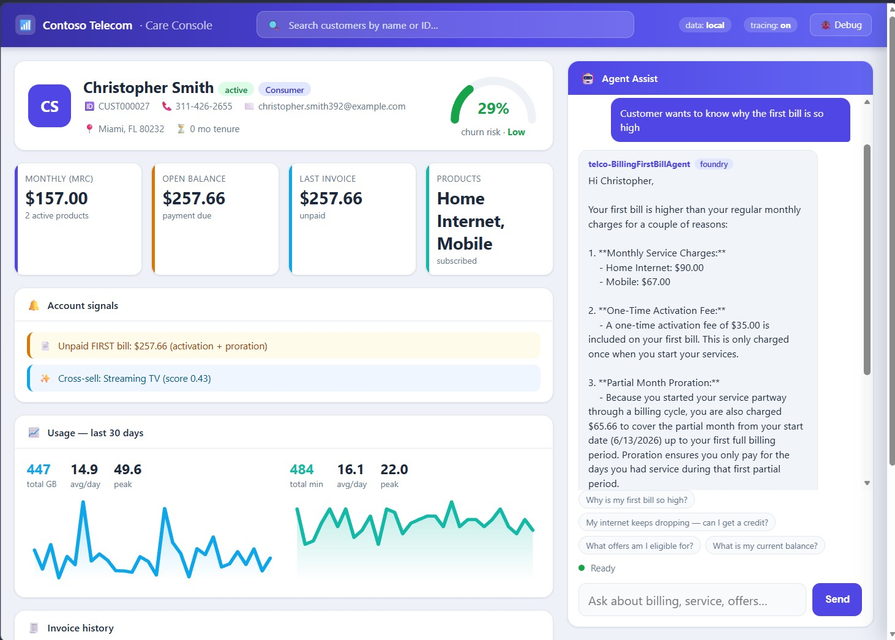
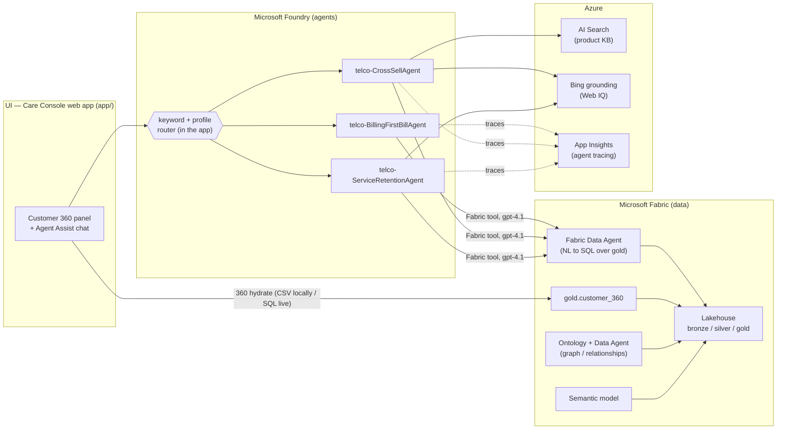
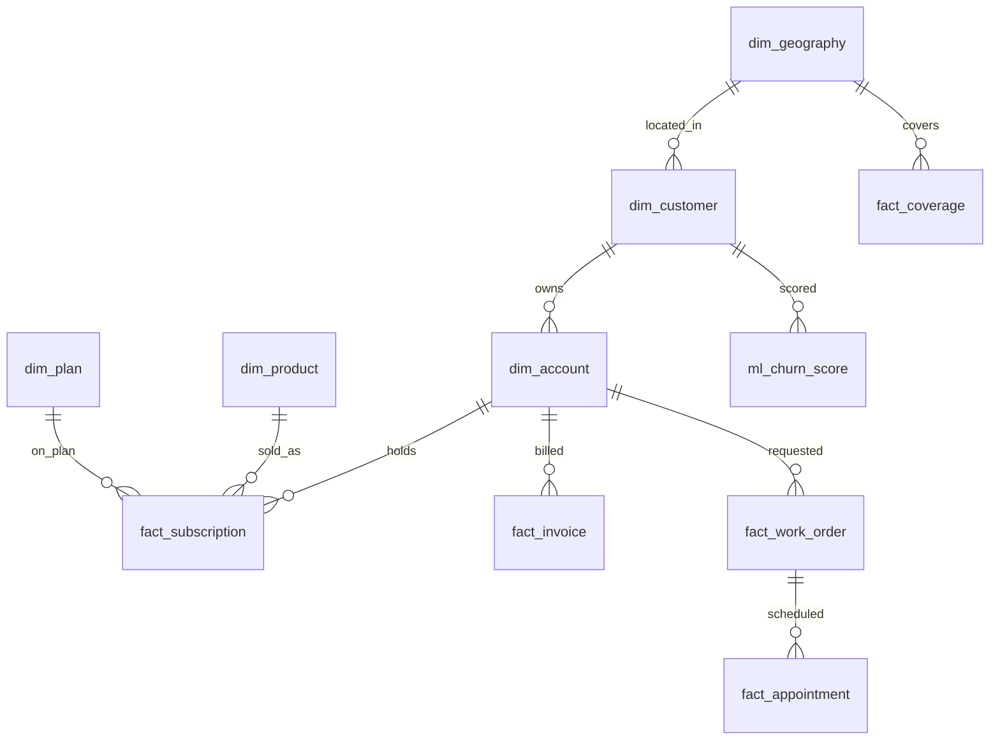

# Telco Customer Service AI — Microsoft Fabric + Foundry Demo

A reference solution that stands up a **customer-service AI experience for a Telecommunications
company** on Microsoft Fabric (data) and Microsoft Foundry (agents), with a web-based agent
console as the UI. Because the scenario starts with **no data**, the repo first **generates a
synthetic telco dataset**, loads it into a **Fabric Lakehouse**, and exposes it to AI agents.

Everything is reproducible from this repo with **Windows PowerShell** + **Fabric notebooks**.
Some Fabric steps (semantic model, ontology, publishing the Data Agent) are done **manually in
the Fabric portal** and are documented step-by-step.



*The Care Console: a Customer 360 (identity, churn-risk gauge, KPIs, invoices, work orders, usage
charts) on the left, and an Agent Assist chat that routes to Foundry journey agents on the right.*

---

## How it fits together



- **Customer 360** hydrates from Fabric (the SQL endpoint over `gold.customer_360`). In this
  demo the web app runs **locally against committed CSVs**; the live SQL path is a one-flag pivot.
- **Agent Assist** picks a journey agent (billing / cross-sell / service-retention) with a light
  keyword + profile **router in the app** — there is no orchestrator agent (the current Foundry
  SDK has no connected-agent tool). Each agent is **gpt-4.1** with the **Fabric Data Agent** tool
  (+ AI Search / Bing where relevant), so answers are grounded in real Lakehouse data.

See [`docs/architecture.md`](docs/architecture.md) for the full component breakdown.

## What the agents can answer

| Journey | Agent | Example questions |
|---|---|---|
| First-bill support | `telco-BillingFirstBillAgent` | "Why is my first bill so high?" · "What's my current balance?" · "When is my payment due?" |
| Acquisition & cross-sell | `telco-CrossSellAgent` | "What offers am I eligible for?" · "Can I add a mobile line?" · "What internet speeds are available at my address?" |
| Service & retention | `telco-ServiceRetentionAgent` | "My internet keeps dropping — can I get a credit?" · "Any open work orders on my account?" · "I want to cancel — what can you do?" |

Answers are **AI-composed and grounded**: the agent (gpt-4.1) calls the Fabric Data Agent, gets
rows from the Lakehouse, and writes the reply with a `【source】` citation — never a raw dump.

## Data model (core entities)



Full table catalog, grains, and journey→table mapping: [`docs/data-model.md`](docs/data-model.md).
The same entities back the **Fabric IQ Ontology** ([`fabric/ontology/`](fabric/ontology)) so the
Data Agent can traverse relationships (e.g. geography → coverage).

## Try it instantly (no cloud)

The Care Console runs fully locally off the committed sample data — no Azure/Fabric needed:

```powershell
./scripts/00_prereqs.ps1                                  # creates .venv + installs deps
python ./data-generation/generate.py --customers 1000     # writes data/csv + data/parquet (note: repo has a sample 1000 customer set, only run this if you want to create a new data set)
./.venv/Scripts/pip install -r app/requirements.txt
cd app; ../.venv/Scripts/python -m uvicorn main:app --port 8000
# open http://localhost:8000  — search "Natasha Ryan" or "CUST000001"
```

Chat answers run against the live Foundry agents if `.env` is configured (below); otherwise the
app returns a local 360 summary so it still works offline.

## Full setup (reproduce everything)

The end-to-end runbook — provisioning Fabric, loading data, publishing the Data Agent, building
the semantic model + ontology, and deploying the Foundry agents — is in
**[`docs/setup-guide.md`](docs/setup-guide.md)**. Start by copying the env template:

```powershell
Copy-Item .env.example .env   # then fill in your workspace/subscription/Foundry values
```

Each area has its own focused README:

| Area | README |
|---|---|
| Synthetic data generator | [`data-generation/`](data-generation) |
| Fabric notebooks (Lakehouse, medallion, ML, Data Agent) | [`fabric/notebooks/`](fabric/notebooks) |
| Semantic model (manual, portal) | [`fabric/semantic-model/README.md`](fabric/semantic-model/README.md) |
| Ontology (manual, Fabric IQ) | [`fabric/ontology/README.md`](fabric/ontology/README.md) |
| Real-Time Intelligence (Eventhouse / KQL) | [`fabric/eventhouse/README.md`](fabric/eventhouse/README.md) |
| Fabric Data Agent config | [`fabric/data-agent/`](fabric/data-agent) |
| Azure infra (Bicep, optional) | [`infra/`](infra) |
| Foundry agents + prerequisites | [`foundry/README.md`](foundry/README.md) |
| Care Console web app | [`app/README.md`](app/README.md) |
| Teams / M365 (future) | [`teams/README.md`](teams/README.md) |

## What's built (status)

| Phase | Status | Notes |
|---|---|---|
| 1 — Fabric data backend | Done | Lakehouse (bronze/silver/gold), synthetic data, trained churn model, `customer_360`, published Data Agent |
| — Semantic model | Done (manual) | `TelcoCustomerService`, built in the portal from `model_spec.yaml` |
| — Ontology (Fabric IQ) | Done (manual) | `TelcoOntology` — 11 entities, 10 relationships; second data agent over it |
| — Real-Time Intelligence (Eventhouse/KQL) | Done | `telco_realtime` Eventhouse: `OutageEvents` + `WebSessions` (customer-keyed); generated + loaded by script. Ontology binding is manual (documented) |
| 2 — Azure / Foundry setup | Done | Reused an existing Foundry resource group + project; gpt-4.1; AI Search index; App Insights tracing |
| 3 — Foundry agents | Done | 3 journey agents (gpt-4.1) with Fabric / AI Search / Bing tools; app-side routing (no orchestrator) |
| 4 — Web app (Care Console) | Done | Local-CSV mode; live Fabric SQL 360 is a one-flag future |
| — Teams / M365 Copilot | Future | Scaffolded in `teams/`; not wired |
| 5 — Demo scenarios | Done | [`docs/demo-scenarios.md`](docs/demo-scenarios.md) |

## Environment notes

- **Windows-on-Arm**: the Fabric Python SDKs (sempy / data-agent-sdk) don't run locally on
  Arm64, so those steps run **in Fabric notebooks** or the portal — documented as such.
- **Foundry model**: use **gpt-4.1** (or gpt-4o). The Agent Service tools (Fabric / AI Search /
  Bing) are **not supported on gpt-5** in westus3.
- **No secrets in the repo**: they live in `.env` (git-ignored). `.env.example` documents every key.

## Repository layout

```
data-generation/  synthetic telco data generator (Python)
data/             generated sample data (CSV + Parquet + KQL CSVs), committed
fabric/           notebooks, semantic-model spec, ontology, eventhouse (KQL), data-agent config
scripts/          PowerShell automation (prereqs, SPN, provision, load, eventhouse, ontology export)
infra/            Azure resources (Bicep) — optional, for fresh deployments
foundry/          Foundry agent definitions + deploy + knowledge/tracing setup
app/              Care Console web app (FastAPI)
teams/            Teams / M365 Copilot manifests (future)
docs/             architecture, data model, setup runbook, demo scenarios, handoff
```

New here? Read [`docs/handoff.md`](docs/handoff.md) for a developer orientation. Resetting to a
clean slate for a from-scratch test is documented in
[`docs/setup-guide.md`](docs/setup-guide.md).
