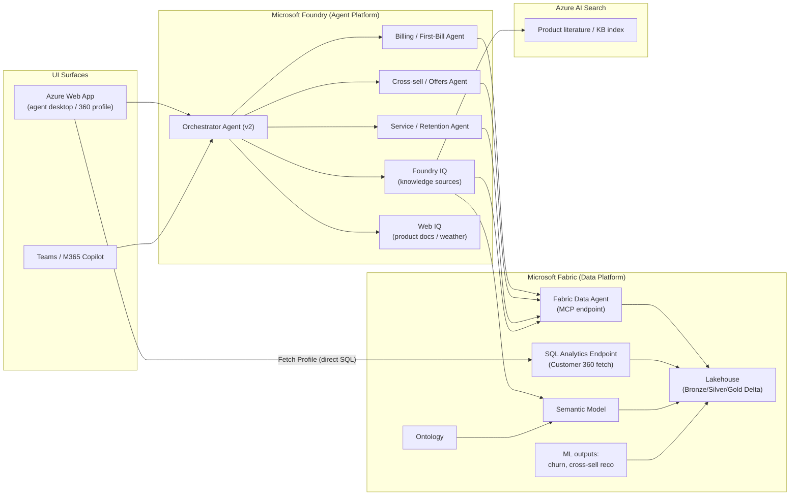

# Architecture

## Overview

The solution is a customer-service AI experience for a Telecommunications company. It is composed of three layers:

1. **Data platform — Microsoft Fabric.** A Lakehouse holds synthetic telco data organized as a Bronze/Silver/Gold medallion. Gold exposes a denormalized `customer_360` used for fast profile hydration. A semantic model and ontology give business meaning to the data, and a **Fabric Data Agent** turns natural-language questions into governed queries.
2. **Agent platform — Microsoft Foundry.** A v2 orchestrator agent routes customer requests to journey-specific agents, which ground their answers in the Fabric Data Agent and in Foundry IQ knowledge sources (Azure AI Search + semantic model). Web IQ supplies external context (product literature, weather).
3. **UI surfaces.** An Azure Web App acts as an agent desktop that hydrates a 360 profile on contact start; Teams / M365 Copilot provides a conversational surface.

## Interaction patterns

**1. Live agent + customer (context hydration).**
When a contact starts, the Web App issues a single well-known query against the **Fabric SQL analytics endpoint** to hydrate the `customer_360` profile. This path is deterministic and low-latency, so it does not need an agent.

**2. Agent interaction (IVR / web chat).**
Free-form customer requests go to the **Foundry orchestrator**, which selects a journey agent. The agent grounds answers using the **Fabric Data Agent** (NL → SQL/DAX/KQL over governed data) and **Foundry IQ** knowledge sources, optionally enriched by **Web IQ**.

## Component responsibilities

| Component | Responsibility |
|---|---|
| Lakehouse | Store raw + curated telco data as Delta tables |
| SQL analytics endpoint | Serve the deterministic `customer_360` fetch |
| Semantic model | Business-friendly metrics/relationships for BI + Data Agent |
| Ontology | Shared vocabulary that maps business terms to model entities |
| Fabric Data Agent | Governed natural-language querying, exposed via MCP |
| Foundry orchestrator | Intent detection + routing across journey agents |
| Journey agents | Task-specific reasoning for the three customer journeys |
| Foundry IQ | Multi-source retrieval (AI Search index, semantic model, Data Agent) |
| Web IQ | External web context (product docs, weather for outages) |
| Azure AI Search | Index of product literature / KB content |
| Web App | Agent desktop; 360 profile + chat |
| Teams / M365 | Conversational entry point |

## Security & identity

- A **service principal** created by `setup_spn.ps1` is granted **admin** on the Fabric workspace and is used by all provisioning scripts.
- Foundry connects to the Fabric Data Agent using **on-behalf-of** auth within the same Entra tenant.
- Secrets live in `.env` (git-ignored) locally and in **Key Vault** for deployed components.

See [`data-model.md`](data-model.md) for the entities and table design, and [`setup-guide.md`](setup-guide.md) for the reproducible runbook.
