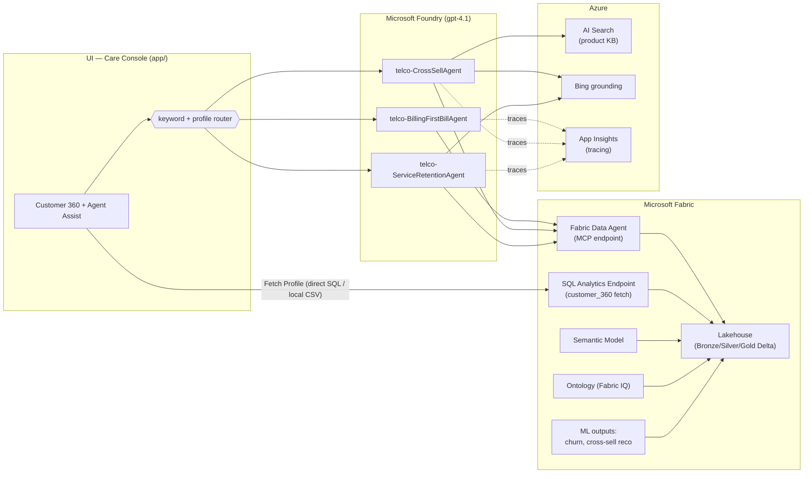

# Architecture

## Overview

The solution is a customer-service AI experience for a Telecommunications company. It is composed of three layers:

1. **Data platform — Microsoft Fabric.** A Lakehouse holds synthetic telco data organized as a Bronze/Silver/Gold medallion. Gold exposes a denormalized `customer_360` used for fast profile hydration. A semantic model and a **Fabric IQ ontology** give business meaning to the data, and a **Fabric Data Agent** turns natural-language questions into governed queries.
2. **Agent platform — Microsoft Foundry.** Three **independent journey agents** (gpt-4.1) each ground answers in the Fabric Data Agent, plus Azure AI Search (product KB) and Bing grounding (Web IQ) where relevant. There is **no orchestrator agent** — the web app does light **keyword + profile routing** to pick the agent (the current Foundry SDK has no connected-agent tool for delegation).
3. **UI surface.** The **Care Console** web app hydrates a 360 profile when an agent opens a customer and provides the Agent Assist chat. It runs locally against committed CSVs in this demo; the live Fabric SQL path is a one-flag pivot. (Teams / M365 Copilot is scaffolded for the future.)

## Interaction patterns

**1. Live agent + customer (context hydration).**
When a contact starts, the Web App issues a single well-known query against the **Fabric SQL analytics endpoint** to hydrate the `customer_360` profile. This path is deterministic and low-latency, so it does not need an agent.

**2. Agent interaction (web chat).**
Free-form customer requests are routed **in the web app** by a lightweight keyword + 360-profile
router to one of three journey agents. The agent (gpt-4.1) grounds answers using the **Fabric
Data Agent** (NL → SQL over governed gold data), and — for the cross-sell/service agents —
**Azure AI Search** (product KB) and **Bing grounding** (Web IQ). Agent runs are traced to
**Application Insights**.

## Component responsibilities

| Component | Responsibility |
|---|---|
| Lakehouse | Store raw + curated telco data as Delta tables (bronze/silver/gold) |
| SQL analytics endpoint | Serve the deterministic `customer_360` fetch |
| Semantic model | Business-friendly metrics/relationships for BI + ontology (built manually) |
| Ontology (Fabric IQ) | Entity graph over gold so the Data Agent can traverse relationships |
| Fabric Data Agent | Governed natural-language querying, exposed via MCP; consumed by Foundry |
| Journey agents (3) | Task-specific reasoning for the three journeys; gpt-4.1 + Fabric/Search/Bing tools |
| App-side router | Keyword + profile intent detection to pick the journey agent (no orchestrator agent) |
| Azure AI Search | Index of product literature / KB content |
| Bing grounding | External web context (product docs, weather for outages) |
| App Insights | End-to-end tracing of agent runs (+ optional web-app spans) |
| Care Console web app | Agent desktop: 360 profile + Agent Assist chat |

## Security & identity

- A **service principal** (`setup_spn.ps1`) is granted **admin** on the Fabric workspace and is used by the provisioning scripts.
- Foundry connects to the Fabric Data Agent using **on-behalf-of (user) auth** in the same Entra tenant — so `deploy_agents.ps1` runs as a signed-in **user**, not the SPN.
- Secrets live in `.env` (git-ignored) locally and in **Key Vault** for deployed components.

See [`data-model.md`](data-model.md) for the entities and table design, and [`setup-guide.md`](setup-guide.md) for the reproducible runbook.
