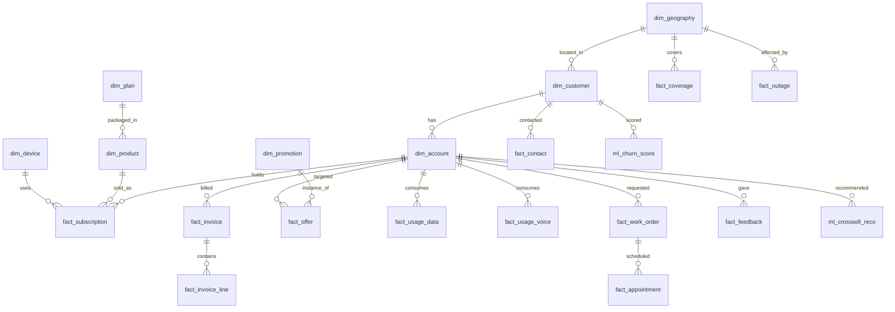

# Data Model

The synthetic dataset models a residential telecommunications provider offering **internet, mobile, and voice** products. Data is generated locally (see [`../data-generation/`](../data-generation)) and loaded into a **schema-enabled** Fabric Lakehouse using a Bronze/Silver/Gold medallion mapped to Lakehouse **schemas**:

- **`bronze`** schema — raw, as-ingested copy of each landing Parquet file (`bronze.dim_customer`, ...).
- **`silver`** schema — created but intentionally **empty for now** (the synthetic source is already clean/conformed, so no separate silver transformations are needed yet).
- **`gold`** schema — curated dimensional tables (`gold.dim_*`, `gold.fact_*`), ML scores (`gold.ml_*`), and the denormalized `gold.customer_360` serving object.

Table names below are unqualified for readability; in the Lakehouse they live under `bronze.` (raw) and `gold.` (curated).

## Entity overview

## Tables

### Dimensions

| Table | Grain | Key columns |
|---|---|---|
| `dim_customer` | one row per customer | `customer_id`, name, dob, segment, tenure_months, contact prefs, `geo_id` |
| `dim_account` | one billing account | `account_id`, `customer_id`, status (active/suspended/cancelled), open_date, autopay, `churn_label` (0/1 training target for the churn model) |
| `dim_geography` | one ZIP/region | `geo_id`, zip, city, state, region, lat/lon |
| `dim_product` | one sellable product | `product_id`, name, category (internet/mobile/voice/tv), monthly_price |
| `dim_plan` | one plan/tier | `plan_id`, name, speed_mbps or data_gb, price, `product_id` |
| `dim_device` | one device **model** (catalog) | `device_id`, model, type (modem/phone/router), monthly_price |
| `dim_customer_device` | one **physical device** per internet account (each account's modem/router) | `device_id` (instance), `account_id`, `customer_id`, `model`, `device_type`, `serial_number`, `install_date`, `status`, `firmware_version` |
| `dim_promotion` | one promo template | `promotion_id`, name, type (retention/acquisition/crosssell), discount, terms |

### Facts

| Table | Grain | Notes |
|---|---|---|
| `fact_subscription` | customer's product instance | `subscription_id`, `account_id`, `product_id`, `plan_id`, `device_id`, start/end, mrc |
| `fact_invoice` | one monthly invoice | `invoice_id`, `account_id`, period, amount, due_date, paid, **`is_first_bill`** |
| `fact_invoice_line` | one charge line | `invoice_id`, description, amount, category (recurring/usage/one-time/credit) |
| `fact_offer` | offer presented to account | `offer_id`, `account_id`, `promotion_id`, presented_date, status (offered/accepted/declined) |
| `fact_contact` | one interaction | `contact_id`, `customer_id`, channel (web/ivr/agent/chat), reason, timestamp, `handoff` flag |
| `fact_usage_data` | daily data usage | `account_id`, date, gb_used |
| `fact_usage_voice` | daily voice usage | `account_id`, date, minutes |
| `fact_coverage` | speed available by ZIP | `geo_id`, technology, max_down_mbps, max_up_mbps |
| `fact_outage` | outage event | `outage_id`, `geo_id`, start, end, severity, resolved |
| `fact_service_metric` | daily service KPI | `account_id`, date, latency_ms, packet_loss_pct, uptime_pct |
| `fact_work_order` | ticket / truck-roll | `work_order_id`, `account_id`, type, opened, closed, status, resolution |
| `fact_appointment` | scheduled visit | `appointment_id`, `work_order_id`, window_start, window_end, status |
| `fact_feedback` | survey response | `feedback_id`, `account_id`, csat (1-5), nps (0-10), comment, date |

### ML outputs (Gold)

| Table | Notes |
|---|---|
| `ml_churn_score` | `customer_id`, `account_id`, churn_probability, risk_band, top_reason, scored_date. **Produced by a trained scikit-learn model** (GradientBoosting) in notebook `04`, logged to an MLflow experiment and registered as a Fabric ML model (`telco_churn_model`). Trained on `dim_account.churn_label`. (The committed `ml_churn_score` CSV/Parquet is a rule-based reference used only by the offline no-cloud web app.) |
| `ml_crosssell_reco` | `account_id`, recommended_product_id, recommended_promotion_id, score, rationale. Product-gap logic (recommend a product the account doesn't own). |

### Gold serving object

| Object | Purpose |
|---|---|
| `customer_360` | Denormalized per-customer profile: identity, account status, active subscriptions, current balance / first-bill flag, recent contacts, open work orders, outage exposure, churn risk, top cross-sell — the single object the Web App fetches via the SQL endpoint |

## Journey → data mapping

| Journey | Primary tables |
|---|---|
| **1. Acquisition + handoff → cross-sell** | `dim_customer`, `fact_subscription`, `dim_product`, `ml_crosssell_reco`, `fact_offer`, `fact_contact` (handoff) |
| **2. First-bill support** | `fact_invoice` (`is_first_bill`), `fact_invoice_line`, `fact_subscription`, `dim_plan` |
| **3. Service degradation & retention** | `fact_outage`, `fact_service_metric`, `fact_work_order`, `ml_churn_score`, `dim_promotion`/`fact_offer` (credit/save) |

## Real-time data (Eventhouse / KQL)

Separate from the Lakehouse, a **`telco_realtime` Eventhouse** holds two **customer-keyed**
real-time tables (generated by `data-generation/generate_realtime.py`, loaded by
`scripts/30_provision_eventhouse.ps1`):

| KQL table | Grain | Key columns |
|---|---|---|
| `DeviceMetrics` | one telemetry reading per device over time (real-time feed) | `device_id`, `account_id`, `reading_time`, `is_online`, `utilization_pct`, `downstream_mbps`, `upstream_mbps`, `latency_ms` |
| `OutageEvents` | one outage impact per customer | `event_id`, `customer_id`, `account_id`, `geo_id`, `event_time`, `outage_type`, `severity`, `status`, `affected_service`, `duration_minutes`, `restored_time`, `reported_by_customer` |
| `WebSessions` | one web session per customer | `session_id`, `customer_id`, `session_start/end`, `duration_seconds`, `device_type`, `browser`, `os`, `entry_page`, `exit_page`, `page_views`, `referrer`, `authenticated`, `converted` |

Column types are ontology-binding safe (`string`/`datetime`/`real`/`long`/`bool`; no `decimal`).
The recommended real-time model is **`DeviceMetrics`** bound as a **time-series** feed on a
**`Device`** entity (from `dim_customer_device`), related to Account via `account_has_device` —
this is the pattern the ontology Data Agent handles cleanly for "metric over time" questions.
See [`../fabric/eventhouse/README.md`](../fabric/eventhouse/README.md).

## Generation principles

- **Deterministic**: a fixed seed (`DATA_SEED`) makes every run reproducible.
- **Referentially consistent**: child rows only reference existing parents.
- **Realistic distributions**: tenure, usage, churn risk, and first-bill timing follow plausible shapes so the demo journeys have signal.
- **Small by default**: ~1,000 customers keeps committed files tiny; scale with `--customers`.

Output is written to `data/csv/` (readable, diff-friendly) and `data/parquet/` (load-ready).
